User & Permission Management System

## 📌 Project Overview

This project demonstrates how to manage users, groups, and permissions in a Linux environment. It focuses on implementing secure access control using standard permission models and Access Control Lists (ACL) to simulate real-world system administration tasks.

## 🛠 Technologies Used

- Linux (RHEL)  
- User Management: `useradd`, `usermod`  
- Group Management: `groupadd`  
- Permissions: `chmod`, `chown`  
- ACL: `setfacl`, `getfacl`  

## ⚙️ Implementation Steps

- Created users and groups for different roles (developers, testers)  
- Assigned users to appropriate groups  
- Created project directories for each group  
- Configured ownership and permissions using `chmod` and `chown`  
- Implemented ACL to grant special access to specific users  
- Tested access control for both authorized and unauthorized users  

## 📸 Screenshots

## User and group creation
## users
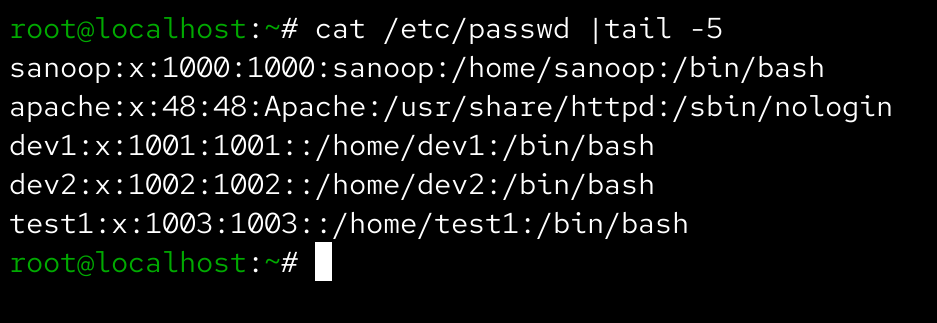

## groups
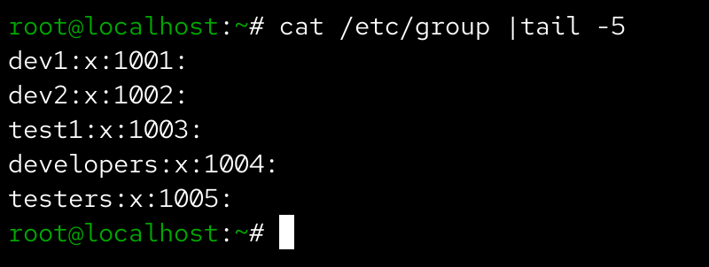

## user_added_to_group
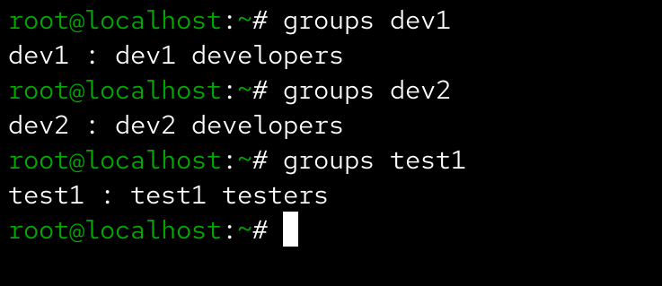

## Directory structure and permissions
## folders_created
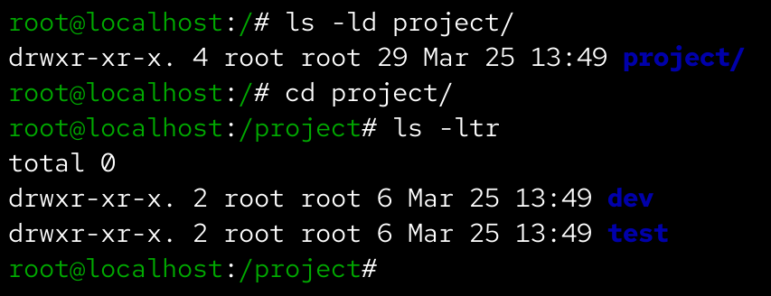

## chown_chmod
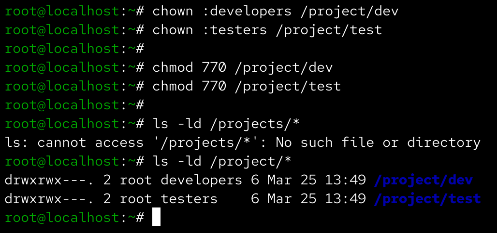

## accessed_and_denied_permissions
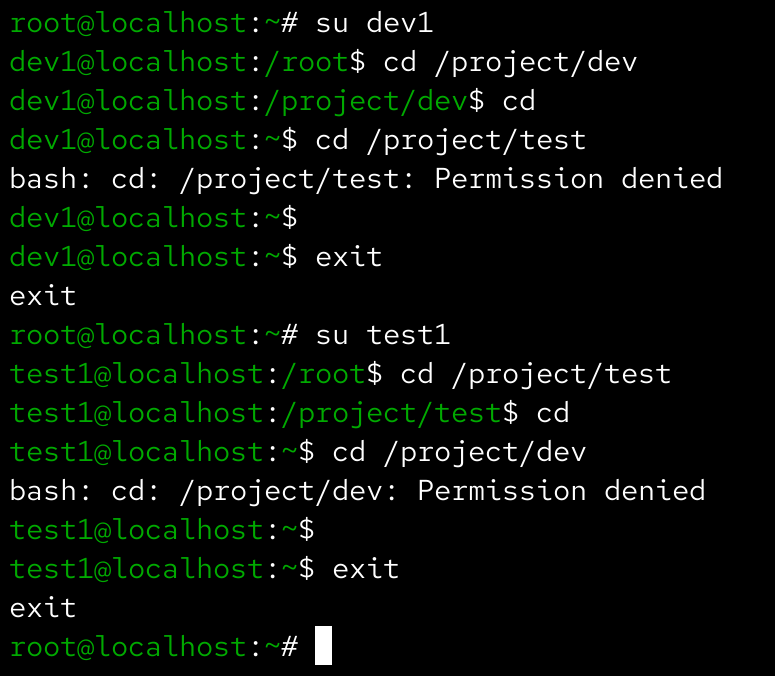

## ACL configuration
## sudoers_notworked
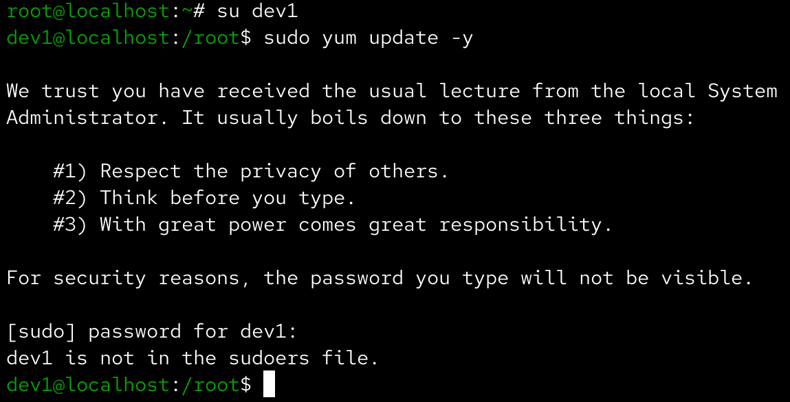

## visudo_file
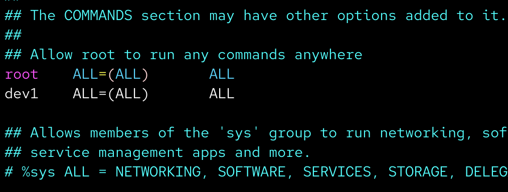

## sudo_access_working
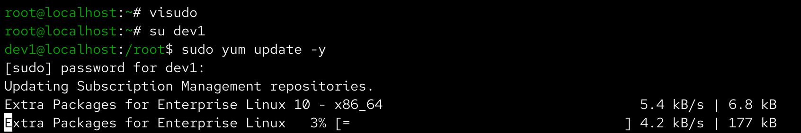

## chage-passwd
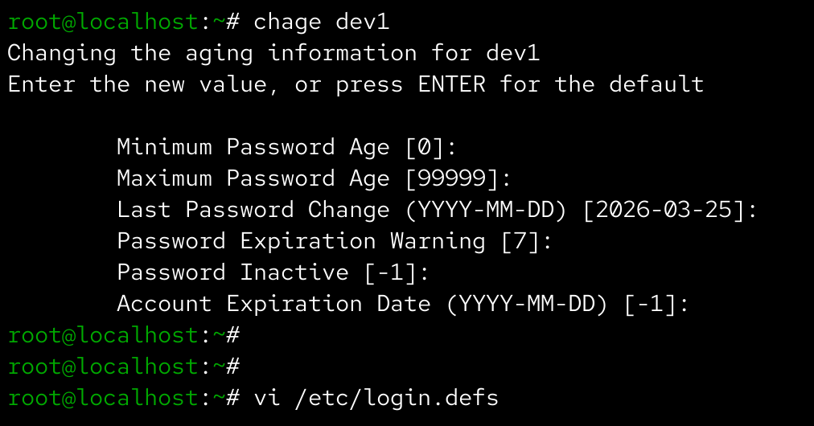

## login.defs_configfile
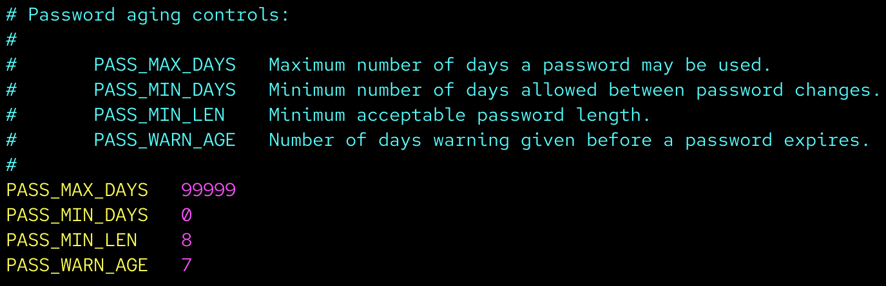

## setfacl_getfacl
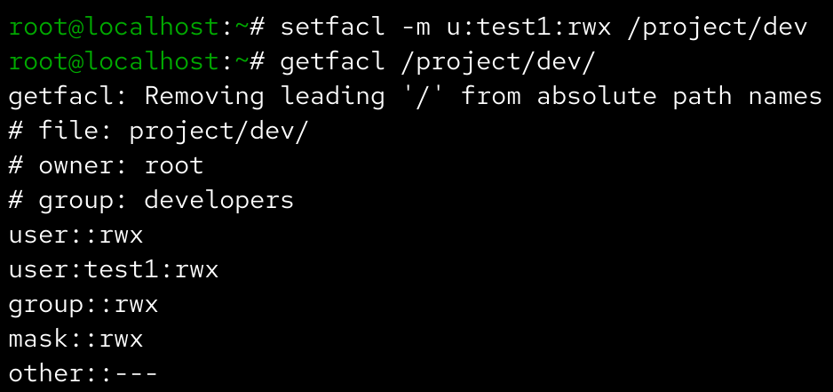

## ✅ Outcome

Successfully implemented a secure user and permission management system, demonstrating real-world Linux administration skills such as access control, privilege management, and system security.
